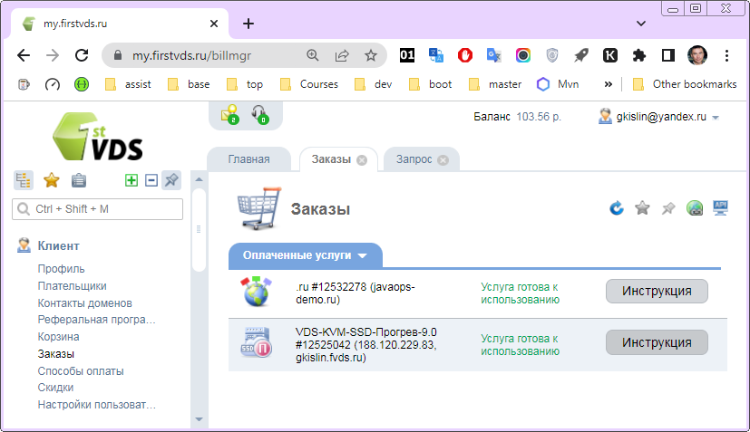

### [Создание пользователя](#user)
### [Регистрация своего домена](#domain_registration)

---

<h2><a id="user">Создание пользователя</a></h2>

[Работать из под `root` небезопасно](https://www.google.com/search?q=Lunux+почему+не+рекомендуется|нельзя+root): создадим нового пользователя с домашним каталогом и дадим ему права на команды администрирования (включим в группу `sudo`):

`useradd -m -s /bin/bash -G sudo your_user`    
`pinky -l your_user`  - информация о пользователе  

`passwd test-user` - задать пароль  
`su - your_user` - сменить пользователя `root` на созданного  
`cd ~` - перейти в домашний каталог  
`sudo -l` - проверить свои права на выполнение команд от имени `root`  
`exit` - вернуться в `root`  

Далее при коннекте к серверу заходите уже не как `root`, а вновь созданный пользователь

[Управление пользователями](https://firstvds.ru/technology/linux-user-management)

<h2><a id="domain_registration">Регистрация своего домена (опционально)</a></h2>

Зарегистрировать свой домена, пример [javaops-demo.ru](https://javaops-demo.ru/), можно на множестве ресурсов.  
Если вы брали хостинг [FirstVDS](https://firstvds.ru/), имеет смысл не экономить 50-70 руб., а [**заказать домен за 250 руб/год**](https://firstvds.ru/services/domain_names) здесь же.

Далее в _заказах->Инструкция_ к VDS есть ваши креденшелы [DNSmanager](https://msk-dns2.hoztnode.net/dnsmgr)

Войдите в него и [**заполните нужные поля**](https://firstvds.ru/technology/dns/create-domain-dnsmanager)  
Домен указывать второго уровня, тот, что вы заказали.  
Если на сервере еще ничего не поднято, проверить связь можно через telnet и как вход по ssh уже использовать ваш домен:

`telnet javaops-demo.ru 22`  
Ctrl+C, Enter