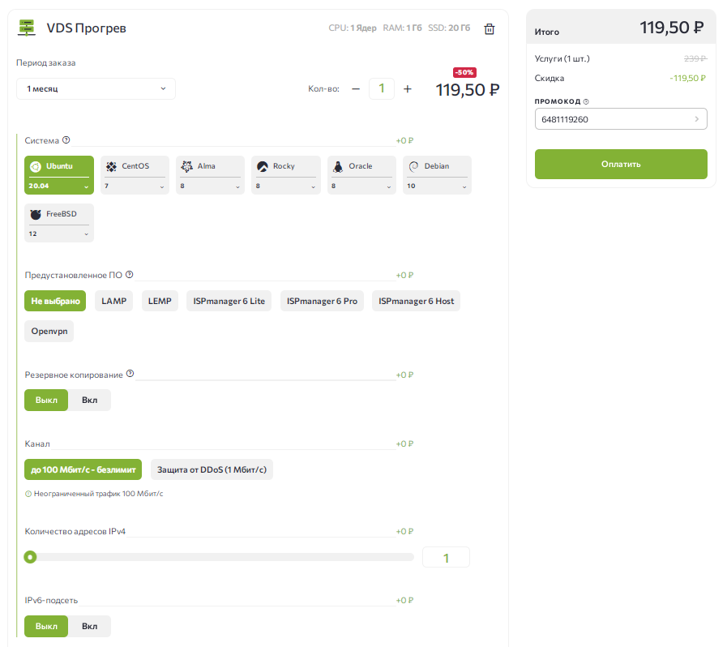
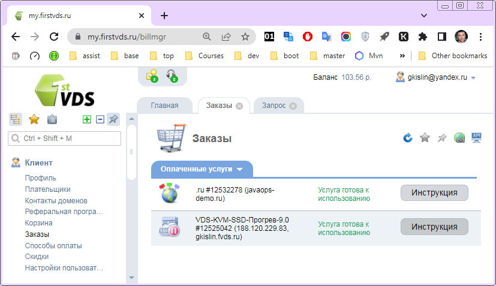

### [Хостинг](#hosting)
### [Требования и регистрация хостинга](#hosting_registration)
### [Доступ к серверу](#hosting_acces)
### [Регистрация своего домена ](#domain_registration) (опционально)

---

<h2><a id="hosting">Хостинг</a></h2>

Хостинг — это сервис для размещения сайтов. Проще всего его представить как удаленный сервер, на котором находятся все файлы сайта, постоянно подключенный к интернету и работающий круглосуточно. Хостингом владеет компания-хостер, с которой
договаривается владелец сайта. Такие компании еще называют хостинг-провайдерами.
- [Что такое хостинг?](https://firstvds.ru/technology/hosting)

Виды веб-хостинга:
- Бесплатный хостинг: бесплатно с ограниченным функционалом и возможно - рекламой.
- Виртуальный хостинг: множество веб-сайтов расположено на одном веб-сервере. Используется под небольшие веб-проекты (обычно статический html + php)
- **Виртуальный выделенный сервер**: на одном сервере поднято несколько виртуальных машин со своими операционными системами. Вам дается полный доступ к администрированию своей виртуальной машины.
- Выделенный сервер: целый физический сервер в полное пользование.
- Размещение оборудования: место под ваше оборудование в датацентре провайдера.
- Облачный хостинг: [Heroku](heroku.com), [Railway.app](https://railway.app/) (модель Infrastructure as a Service, IaaS — инфраструктура как сервис). Прямого доступа к операционке нет, администрирование чз интерфейс провайдера.

Существуют также гибридные модели хостинга, смешивающие в себе свойства вышеперечисленных видов хостинга.
- [Виды веб-хостинга](https://firstvds.ru/technology/hosting#webhost)

<h2><a id="hosting_registration">Требования и регистрация хостинга</a></h2>

Нам подходит:
- **Виртуальный выделенный сервер** - дешевый, с полным доступом к администрированию по ssh и с публичным IP для доступа.  
  Если планируется только одно небольшое приложение - можно выбирать самый недорогой тариф: **RAM 1G, SSD от 10Gb, публичный IP**.
    - [FirstVDS](https://firstvds.ru/?from=1119260), попробуйте с промокодом `6481119260`
    - [MakeCloud](https://makecloud.ru/), [RUVDS](https://ruvds.com/ru-rub/pricing#order), [HOSTING RUSSIA](https://hosting-russia.ru/tariffs), [VPSdedic](https://vpsdedic.ru/vpsserver.html), [Timeweb](https://timeweb.com/ru/services/vds/), [Джино](https://jino.ru/vps/), [VpsVille](https://vpsville.ru/vds-vps-hosting/)

- Настройка сервера:
    - ОС: последний [Ubuntu](https://ru.wikipedia.org/wiki/Ubuntu) (самый популярный GNU Linux), если нет особых предпочтений.
    - Без предустановленное ПО
    - Без резервного копирования
    - Без защиты от DDoS
    - Без IPv6-подсети

Пример от FirstVDS:  

<h2><a id="hosting_acces">Доступ к серверу</a></h2>

Информация о доступе к Хостингу может прийти в письме  
Для FirstVDC, она находится в *Личном Кабинете -> Заказы (Orders) -> Инструкция*  
Основная информация: **IP-адрес сервера/ Логин/ Пароль**

Для доступа к серверу нам нужен клиент [SSH](https://ru.wikipedia.org/wiki/SSH).
`ssh` обеспечивает безопасное соединение с сервером, используя шифрованный канал. Протокол обеспечивает неуязвимость к аттакам вида [человек посередине](https://ru.wikipedia.org/wiki/Человек_посередине)

Коннектимся к своему серверу:

`ssh user@server.addr` (порт по умолчанию - 22)   
`ssh -p port user@server.addr` (если порт отличается от стандартного 22)

Здесь:  
`user` - логин пользователя _на сервере_   
`server.addr` — адрес сервера, задаётся либо в ip-формате, либо в форме `DNS` (если он настроен).

Клиент `ssh` «из коробки» уже предустановлен на большинстве версий `linux` и во всех современных `macOS`  
Если в `Windows` клиент `ssh` не установлен, его можно установить например вместе с Git с поддержкой `Git Вash`.  
Также под Windows часто используется клиент [PuTTY](https://www.putty.org/) - в поле `HostName(or IP address)` можно задать сразу `user@server.addr`.

- [Подключение к Linux-серверу](https://firstvds.ru/technology/linux-server-connection)
- [Подключение по SSH терминалу](https://firstvds.ru/technology/how-to-connect-to-the-server-via-ssh)
- [Особенности терминала](https://firstvds.ru/technology/linux-terminal-features)

Команды linux:
- `pwd` - показать текущий каталог
- `alias` - показать список "автозамен". Настраиваемые команды, можно создавать свои.
- `ls` - показать содержимое каталога
- `cd` - смена каталога
    - `cd ..` - перейти в родителя
    - `cd /` - перейти в корень
    - `cd ~`  - перейти в домашний каталог (у каждого юзера свой)
- `exit` - завершить сеанс

--------------------

- [Основы командной строки Linux](https://firstvds.ru/technology/basic-linux-commands)
- [Структура команд](https://firstvds.ru/technology/linux-commands-structure)
- [Структура каталогов Linux](https://firstvds.ru/technology/linux-directories-structure)
- [Как создать собственную команду в Linux](https://firstvds.ru/technology/kak-sozdat-sobstvennuyu-komandu-v-linux)
- [Управление ПО](https://firstvds.ru/technology/linux-software-management)

После первого входа меняем пароль: 

`passwd`

[Изменение пароля Root](https://firstvds.ru/technology/change-root#notisp)

<h2><a name="domain">Регистрация своего домена (опционально)</a></h2>

Зарегистрировать свой домена, пример [javaops-demo.ru](https://javaops-demo.ru/), можно на множестве ресурсов.  
Если вы брали хостинг [FirstVDS](https://firstvds.ru/), имеет смысл не экономить 50-70 руб., а [**заказать домен за 250 руб/год**](https://firstvds.ru/services/domain_names) здесь же.

Далее в _заказах->Инструкция_ к VDS есть ваши креденшелы [DNSmanager](https://msk-dns2.hoztnode.net/dnsmgr)

Войдите в него и [**заполните нужные поля**](https://firstvds.ru/technology/dns/create-domain-dnsmanager)  
Домен указывать второго уровня, тот, что вы заказали.  
Если на сервере еще ничего не поднято, проверить связь можно через telnet и как вход по ssh уже использовать ваш домен:

`telnet javaops-demo.ru 22`  
Ctrl+C, Enter

### [Основы работы c Unix](base.md)
