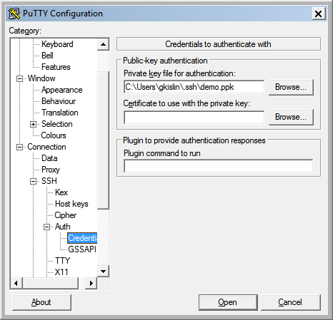

### [Настройка ssh ключей](https://ruvds.com/ru/helpcenter/ssh-ubuntu-18-04-linux/)
[Set up SSH Keys on a Linux](https://www.cyberciti.biz/faq/how-to-set-up-ssh-keys-on-linux-unix/)

С ssh ключами удобно заходить на сервер без пароля и они нужны при коммитах в git по ssh.  

SSH-ключи представляют собой пару — закрытый и открытый ключ. Закрытый должен храниться в закрытом доступе у клиента, открытый отправляется на сервер и размещается в файле _authorized_keys_.
При выполнении команды `ssh user@server.addr` клиент устанавливает связь с сервером, подписывая сообщение приватным ключом, сервер (расшифровав его с помощью публичного из `~/.ssh/authorized_keys`) понимает, что это доверенный пользователь и даёт доступ без запроса пароля.

Генерировать ключи можно на локальной машине и копировать публичный на сервер или наоборот - на сервере и скопировать приватный с сервера себе на компьютер.

`ssh-keygen -t rsa`

На все вопросы жмите `enter`, кодовая фраза не нужна. По итогу у нас появятся 2 файла:

- `~/.ssh/id_rsa` - приватный ключ
- `~/.ssh/id_rsa.pub` - публичный ключ

----------------------------------

- Если у вас Linux и ключи генерировали на клиенте, можно воспользоваться специальной утилитой

`ssh-copy-id user@server.addr`

Последует запрос пароля, ключ перепишется, и на сервер можно заходить без ввода пароля.

- Если ключи генерировали на сервере, создаем `authorized_keys`:

`cp ~/.ssh/id_rsa.pub ~/.ssh/authorized_keys`

Если у вас уже есть `authorized_keys` уже есть (в нём могут храниться несколько ключей), то нужно добавить ключ в его конец:  
`cat ~/.ssh/id_rsa.pub >> ~/.ssh/authorized_keys`
 
Далее [копируем](base.md#copy) приватный ключ на клиента в каталог _~\.ssh_ (для Windows это `c:\Users\your_Windows_login\.ssh`)

- [Создание SSH-ключей на Windows с PuTTYgen](https://firstvds.ru/technology/dobavit-ssh-klyuch#windows)

-------------------------

Пробуем зайти по ssh (при первом входе ответить _yes_). По умолчанию берется приватный ключ `~/.ssh/id_rsa`:  
`ssh user@server.addr`
  
Если ssh ключей и серверов много, можно заходит, задать к нему путь:  
`ssh -i ~/.ssh/server.pem user@server.addr`

--------------------------

Чтобы зайти по ключу через PuTTY, ключ надо преобразовать в формат `PuttY` утилитой `puttygen.exe`, которая идет вместе с PuTTY: `Load -> All Files(*.*) -> Save private key` и загрузить сгенерированный ключ в сессию PuTTY:

После этого нужно вернуться на вкладку `Session` и сделать `Save`   
Если ssh проходит, но не работает puttygen, мне помогло обновление на последюю версию.

------------------------------
Если не получилось залогинится, попробуйте сгенерировать ключи еще раз другим способом и/или воспользоваться дебагом:  
`ssh -vvv user@server.addr`

Проверьте права на `.ssh` и файлы и настройки `sshd_config`:  
`cat /etc/ssh/sshd_config | grep PubkeyAcceptedKeyTypes`

Если пусто - нужно добавить разрешение и рестартануть `sshd`:  
`echo "PubkeyAcceptedKeyTypes *"   | sudo tee -a /etc/ssh/sshd_config`  
`sudo systemctl restart sshd.service`

[Пляски с бубном](https://stackoverflow.com/questions/47875126/we-did-not-send-a-packet-disable-method) если не получается зайти по ключам. В крайнем случае у хостинга есть поддержка.

### [Установка Maven, Git, Nginx](maven_git_nginx.md)
